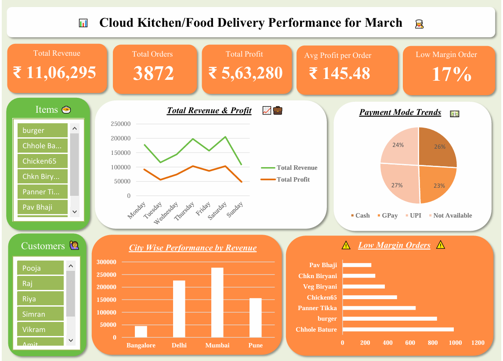

# Cloud Kitchen Performance Dashboard 📈
This project analyzes the performance for March month of a cloud kitchen using Excel. It includes visual dashboards, customer insights, and actionable recommendations.

## 🔍 Key Insights
- Total Revenue: ₹11,06,295
- Total Orders: 3,872
- Average Profit per Order: ₹145.48
- Low-margin Risk: 17% of orders

## 📊 Dashboard Preview

