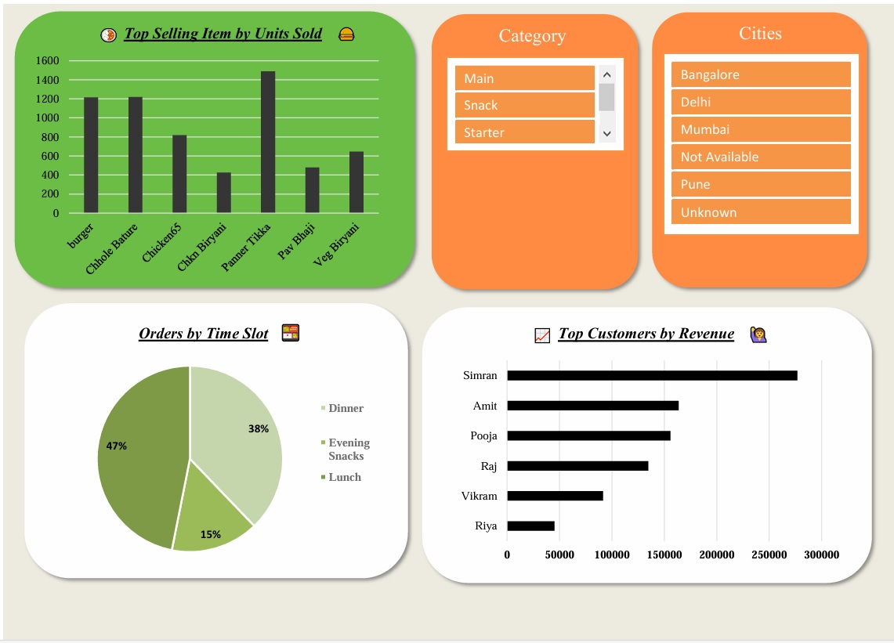

# Cloud Kitchen Performance Dashboard 📈
This project analyzes the performance for March month of a cloud kitchen using Excel. It includes visual dashboards, customer insights, and actionable recommendations.

## 🔍 Key Insights
- Total Revenue: ₹11,06,295
- Total Orders: 3,872
- Average Profit per Order: ₹145.48
- Low-margin Risk: 17% of orders

## 📊 Dashboard Preview

## 🛠 Tools Used
- Microsoft Excel
- Pivot Tables
- Power Pivot
- Data Cleaning using Power Query
- Used Slicers and Filters for deeper Analysis
- Dashboard Design and Visualization

## 💡 Learnings
- Storytelling with data
- Customer behavior analysis
- Visual insights for business decisions

### 🧠 Data Story
